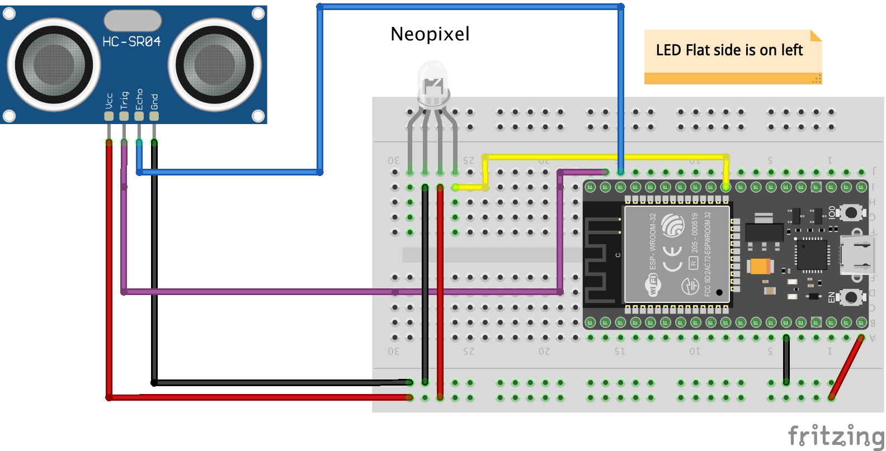
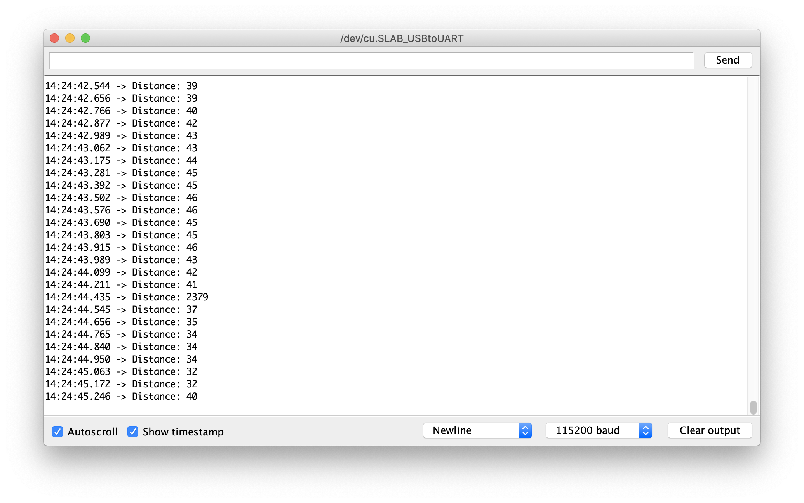

*Quick links :*
[Home](/README.md) - [**Part 1**](../part1/README.md) - [Part 2](../part2/README.md) - [Part 3](../part3/README.md) - [Part 4](../part4/README.md)

***
**Sensor Labs: ** [Sensor](../sensor/README.md) - [Heart sensor](../sensor/PULSE+RGB.md) - [Sensor 1](../sensor/SENSOR1.md) - [Sensor 2](../sensor/SENSOR2.md) - [Sensor 3](../sensor/SENSOR3.md)
***

This part contains instruction to get started with Human Heart Rate/Pulse sensor on ESP32S

## Lab Objectives

In this lab you will learn how to connect the Pulse sensor to the ESP32S board and how to access data from the sensor, then take actions based on the data returned.

You will learn:

- The electrical connections needed to connect the Pulse sensor (pulsensor.com) to the ESP32S
- Run a simple application to read data from the sensor and change color of a Neo Pixel RGB
- The useful library used to build more advanced application using the sensor

Parts in this lab:

- ESP32S (36 pins)
- Human Heart Rate / Pulse sensor (pulsesensor.com)
- Neo Pixel 8mm 
- male-male Jumpers

### Step 1 - Wire the parts together

First you need to wire the part together on a breadboard. Here is the diagram of the example



GPIO 5 is used to control the LED colors. TRIG pin (purple) of the Ultrasoni sensor is connected to analog pin GPIO 22. ECHO pin (blue) is connected to analog pin GPIO 23.

### Step 2 - Input the application code

I've provided the code for the application below. The code is pretty simple with detailed explanation in the form of comments. You can copy and paste into to a new sketch on your Arduino IDE then compile and run it.


```C++
/* This code is to read raw distance signal from a ultrasonic sensor and change the 
 *  color or a Neo Pixel RGB accordinly to a pre-defined distance range
 */
#include <Adafruit_NeoPixel.h>
#define NEOPIXEL_TYPE NEO_RGB + NEO_KHZ800
#define RGB_PIN 5 // GPIO pin the data line of RGB LED is connected to

Adafruit_NeoPixel pixel = Adafruit_NeoPixel(1, RGB_PIN, NEOPIXEL_TYPE);

// RANGE SETTINGS
#define CLOSE 0
#define FAR 200
#define CENTER 50

uint16_t r = 0; // LED RED value
uint16_t g = 0; // LED Green value
uint16_t b = 0; // LED Blue value

void randRGB()
{
  r=random(0,255);
  g=random(0,255);
  b=random(0,255);
  Serial.printf("rgb=%d,%d,%d\n",r,g,b);
  // Set RGB LED Colour
  pixel.setPixelColor(0, r, g, b);
  pixel.show();
}

// defines pins numbers for HC SR04 Sensor
const int trigPin = 23; // TRIGGER PIN
const int echoPin = 22; // ECHO PIN


int t = 0.0; // distance

// defines variables
long duration;
int distance;

void setup() {
  pinMode(trigPin, OUTPUT); // Sets the trigPin as an Output
  pinMode(echoPin, INPUT); // Sets the echoPin as an Input
  Serial.begin(115200); // Starts the serial communication
  pixel.begin();
}

void loop() {
// Clears the trigPin
digitalWrite(trigPin, LOW);
delayMicroseconds(2);
// Sets the trigPin on HIGH state for 10 micro seconds
digitalWrite(trigPin, HIGH);
delayMicroseconds(10);
digitalWrite(trigPin, LOW);
// Reads the echoPin, returns the sound wave travel time in microseconds
duration = pulseIn(echoPin, HIGH);
// Calculating the distance
distance= duration*0.034/2;

t = distance;
// Set RGB LED Colour based on distance
g = (t >= FAR) ? 255 : 0; // TOO FAR SET GREEN
b = (t >= CENTER && t < FAR) ? 255 : 0; // MEDIUM RANGE SET BLUE
r = (t < CENTER) ? 255: 0; // TO CLOSE SET RED
pixel.setPixelColor(0, r, g, b); // SET COLORS
pixel.show(); // SHOW LED COLOR

    
// Prints the distance on the Serial Monitor
Serial.print("Distance: ");
Serial.println(distance);
delay(100);
}
```

### Step 3 - Run the code and view output using the Serial Monitor, Serial Plotter

Save, compile and upload the sketch.  Once uploaded open up the Serial Monitor and set the baud rate to 115200, to match the rate set in the Serial.begin(115200) message.  You should see some basic output showing the raw pulse value read from the pulse sensor as well as the RGB values corresponding to each pulse value returned.  

The LED should be set to a colour based on the pulse value and the threashold set by FAR, CENTER and CLOSE constants defined at the top of the sketch :

- GREEN: Safe distance (Far)
- BLUE: Approaching too close (Center)
- RED: Very close by or unsafe distance (Close)

You can see the graphical view of the pulse output by opening the Serial Plottter view (Remember to close the Serial Monitor view first): Tool >> Serial Plotter



***
**Sensor labs: ** [Sensor](../README.md) - [Heart sensor](../sensor/PULSE+RGB.md) - [Sensor 1](../sensor/SENSOR1.md) - [Sensor 2](../sensor/SENSOR2.md) - [Sensor 3](../sensor/SENSOR3.md)
***