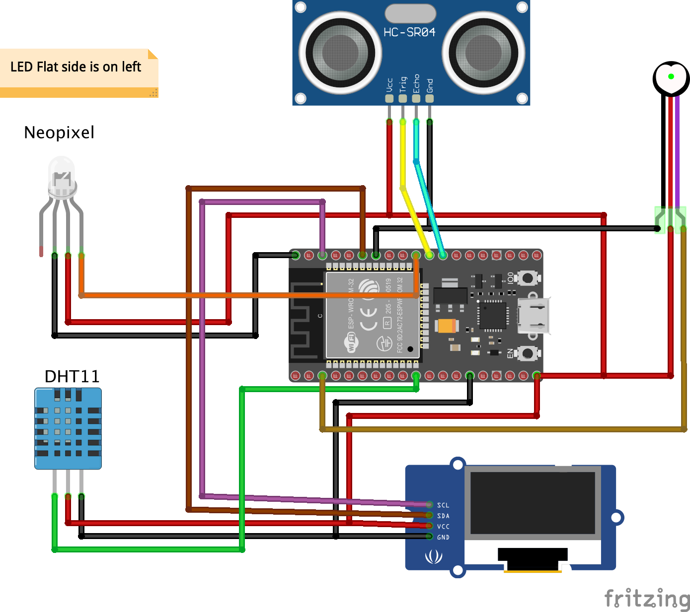
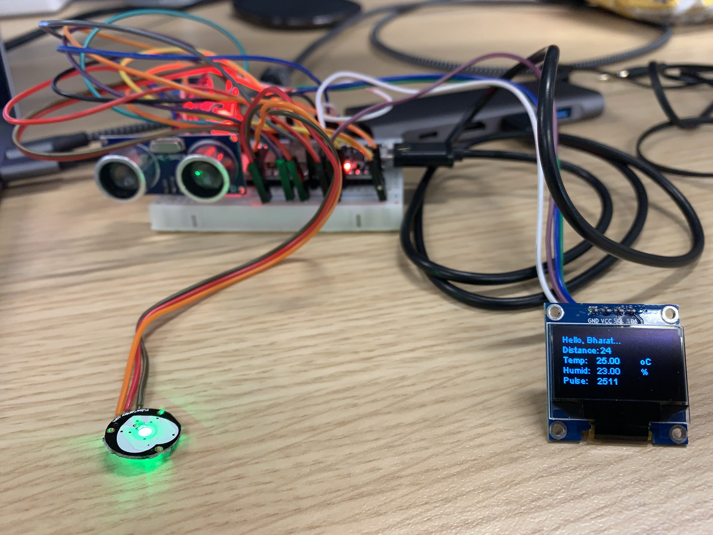
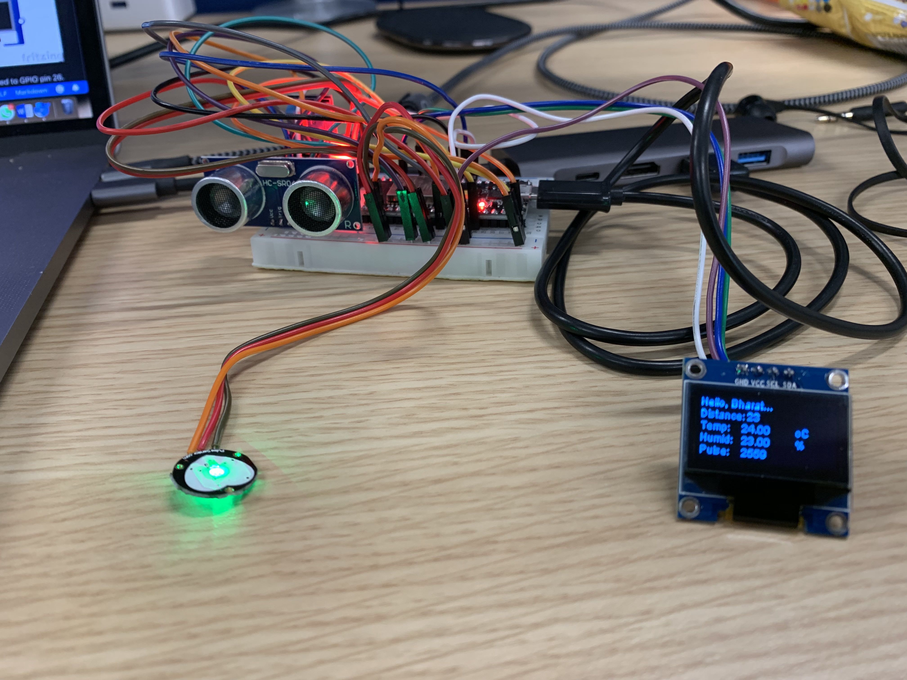

*Quick links :*
[Home](/README.md) - [**Part 1**](../part1/README.md) - [Part 2](../part2/README.md) - [Part 3](../part3/README.md) - [Part 4](../part4/README.md)

***
**Sensor labs: ** [Sensor](README.md) - [Ultrasonic Sensor](ESP32S+Neopixel-LED+HC-SR04.md) - [Pyroelectric Infrared PIR Sensor](ESP32S+Neopixel-LED+PIR.md) - [Heart sensor](PULSE+RGB.md) - [OLED LCD Display Module](SSD1306_Display.md) - [GY-291 ADXL345 Gravity Tilt Module](GY-291_ADXL345_Gyroscope.md) - [**Whopper Sensors**](ESP32S+Pulse+Neopixel-LED+Ultrasonic+DHT11+Display.md) 
***

This part contains instruction to get started with multiple sensors and display sensor on ESP32S

## Lab Objectives

In this lab you will learn how to connect the Pyroelectric Infrared PIR sensor to the ESP32S board and how to access data from the sensor, then take actions based on the data returned.

You will learn:

- The electrical connections needed to connect the Pyroelectric Infrared PIR sensor to the ESP32S
- Run a simple application to read data from the sensor and change color of a Neo Pixel RGB
- The useful library used to build more advanced application using the sensor

Parts in this lab:

- ESP32S (36 pins)
- HC-SR504 Ultra Sonic Sensor
- Neo Pixel 8mm 
- DHT 11 Sensor
- SSD Display
- male-male Jumpers
- male-female Jumpers

### Step 1 - Wire the parts together

First you need to wire the part together on a breadboard. Here is the diagram of the example



GPIO 5 is used to control the LED colors. DHT 11 (green) sensor is connected to GPIO pin 26. SDA pin of display module SSD 1306 (maroon) is connected to GPIO pin 21. SCL pin of display module SSD 1306 (purple) is connected to GPIO pin 22. TRIG pin of Ultrasonic Sensor HC-SR04 (yellow) is connected to GPIO pin 17. ECHO pin of Ultrasonic Sensor HC-SR04 (cyan) is connected to GPIO pin 16. Pulse sensor (brown) is connected to Analog pin 0 (GPIO 36).

### Step 2 - Input the application code

I've provided the code for the application below. The code is pretty simple with detailed explanation in the form of comments. You can copy and paste into to a new sketch on your Arduino IDE then compile and run it.


```C++
/*********************************************
 * This program reads distance from ultrasonic
 * sensor. Changes LED colr based on distance.
 * Reads and display temprature and humidity
 * Also, Reads pulse and displays
 *********************************************/

//#include <Wire.h>  // Only needed for Arduino 1.6.5 and earlier
#include "SSD1306Wire.h" // legacy include: `#include "SSD1306.h"`
#include "DHT.h"

#include <Adafruit_NeoPixel.h>
// Device TYPES
#define NEOPIXEL_TYPE NEO_RGB + NEO_KHZ800
#define DHTTYPE DHT11

// PIN CONFIG
#define RGB_PIN 5 // GPIO pin the data line of RGB LED is connected to
// DHT
#define DHTPIN 26
// Display
#define SDAPIN 21
#define SCLPIN 22
// defines pins numbers for HC SR04 Sensor
const int trigPin = 17; // TRIGGER PIN
const int echoPin = 16; // ECHO PIN
// Pulse Pin

int pulsePin = A0; // Pin Analog 0, or GPIO 36


Adafruit_NeoPixel pixel = Adafruit_NeoPixel(1, RGB_PIN, NEOPIXEL_TYPE);
SSD1306Wire  display(0x3c, SDAPIN, SCLPIN);
DHT dht(DHTPIN, DHTTYPE);

// RANGE SETTINGS
#define CLOSE 0
#define FAR 200
#define CENTER 50

uint16_t r = 0; // LED RED value
uint16_t g = 0; // LED Green value
uint16_t b = 0; // LED Blue value


int t = 0.0; // distance

// defines variables
long duration;
int distance;

float localHum = 0;
float localTemp = 0;

void setup() {
  pinMode(trigPin, OUTPUT); // Sets the trigPin as an Output
  pinMode(echoPin, INPUT); // Sets the echoPin as an Input
  Serial.begin(115200); // Starts the serial communication
  dht.begin();
  pixel.begin();
  // put your setup code here, to run once:
  display.init();
  display.flipScreenVertically();
  display.setFont(ArialMT_Plain_10); //Other fonts available : ArialMT_Plain_16; ArialMT_Plain_24; Or to generate custom fonts: http://oleddisplay.squix.ch/
}

void loop() {
  // put your main code here, to run repeatedly:
  getDHT();
  distance = getDistance();
  plotLED();
  displayData();
  delay(500);
}

void displayData()
{
  display.clear();   // clear the display
  display.drawString(0, 0,  "Hello, Bharat...");
  display.drawString(0, 12, "Distance: ");
  display.drawString(45, 12,  String(distance));

  //  DHT INFO
  display.drawString(0, 24,  "Temp: ");
  display.drawString(40, 24,  String(localTemp));
  display.drawString(90, 24,  "oC");
  display.drawString(0, 36, "Humid:  ");
  display.drawString(40, 36,  String(localHum));
  display.drawString(90, 36,  "%");
  
  // Pulse Information
  display.drawString(0, 48,  "Pulse: ");
  display.drawString(40, 48,  String(getPulse()));
  
  display.display();   // write the buffer to the display
  
  delay(10);
}

int getDistance() 
{
  int dt = 0;
  // Clears the trigPin
  digitalWrite(trigPin, LOW);
  delayMicroseconds(2);
  // Sets the trigPin on HIGH state for 10 micro seconds
  digitalWrite(trigPin, HIGH);
  delayMicroseconds(10);
  digitalWrite(trigPin, LOW);
  // Reads the echoPin, returns the sound wave travel time in microseconds
  duration = pulseIn(echoPin, HIGH);
  // Calculating the distance
  dt= duration*0.034/2;
//  Serial.printf("Distance: ");
//  Serial.print(dt);
  return dt;
}

void plotLED()
{
  t = distance;
  // Set RGB LED Colour based on distance
  g = (t >= FAR) ? 255 : 0; // TOO FAR SET GREEN
  b = (t >= CENTER && t < FAR) ? 255 : 0; // MEDIUM RANGE SET BLUE
  r = (t < CENTER) ? 255: 0; // TO CLOSE SET RED
  pixel.setPixelColor(0, r, g, b); // SET COLORS
  pixel.show(); // SHOW LED COLOR
}

void getDHT()
{
  float tempIni = localTemp;
  float humIni = localHum;
  localTemp = dht.readTemperature();
  localHum = dht.readHumidity();
  if (isnan(localHum) || isnan(localTemp))   // Check if any reads failed and exit early (to try again).
  {
    localTemp = tempIni;
    localHum = humIni;
    return;
  }
}

int getPulse() {
 return analogRead(pulsePin);   
}
```

### Step 3 - Run the code and view output using the Serial Monitor, Serial Plotter

Save, compile and upload the sketch.  Once uploaded open up the Serial Monitor and set the baud rate to 115200, to match the rate set in the Serial.begin(115200) message.  You should see some basic output showing the raw motion value read from the Pyroelectric Infrared PIR sensor as well as the RGB values corresponding to each motion value returned.  

The LED should be set to a colour based on the motion value.

- GREEN: Motion detected
- RED: No motion detected or stopped detecting motion

You can see the graphical view of the pulse output by opening the Serial Plottter view (Remember to close the Serial Monitor view first): Tool >> Serial Plotter





***
**Sensor labs: ** [Sensor](README.md) - [Ultrasonic Sensor](ESP32S+Neopixel-LED+HC-SR04.md) - [Pyroelectric Infrared PIR Sensor](ESP32S+Neopixel-LED+PIR.md) - [Heart sensor](PULSE+RGB.md) - [OLED LCD Display Module](SSD1306_Display.md) - [GY-291 ADXL345 Gravity Tilt Module](GY-291_ADXL345_Gyroscope.md) - [**Whopper Sensors**](ESP32S+Pulse+Neopixel-LED+Ultrasonic+DHT11+Display.md) 
***
*Quick links :*
[Home](/README.md) - [Part 1](../part1/README.md) - [Part 2](../part2/README.md) - [Part 3](../part3/README.md) - [**Part 4**](../part4/README.md) - [Sensors](/en/sensors/README.md)