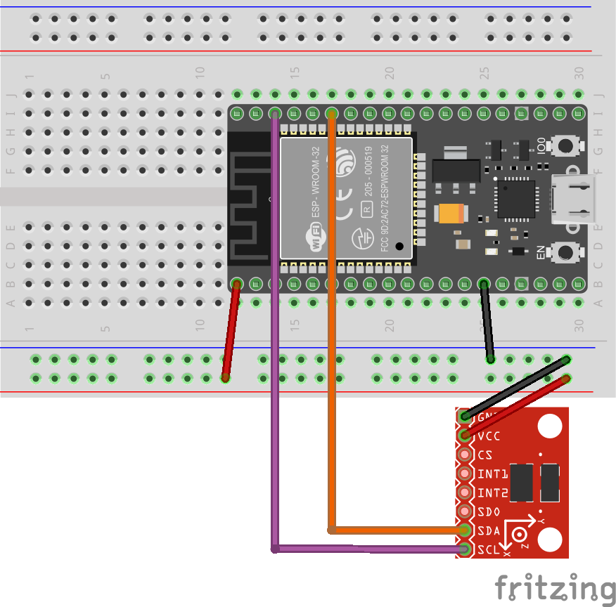
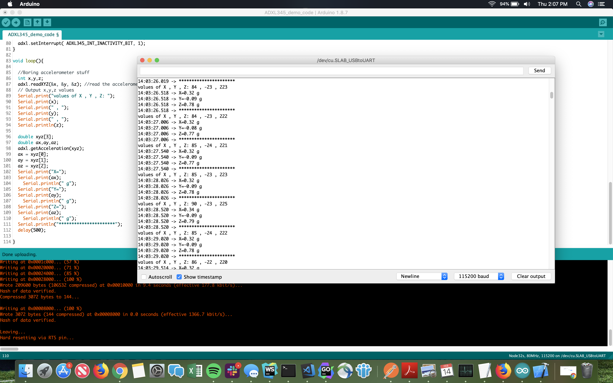

*Quick links :*
[Home](/README.md) - [Part 1](../part1/README.md) - [Part 2](../part2/README.md) - [Part 3](../part3/README.md) - [Part 4](../part4/README.md)  - [**Sensors**](/en/sensors/README.md)

***
**Sensor labs: ** [Sensor](README.md) - [Ultrasonic Sensor](ESP32S+Neopixel-LED+HC-SR04.md) - [Pyroelectric Infrared PIR Sensor](ESP32S+Neopixel-LED+PIR.md) - [Heart sensor](PULSE+RGB.md) - [OLED LCD Display Module](SSD1306_Display.md) - [GY-291 ADXL345 Gravity Tilt Module](GY-291_ADXL345_Gyroscope.md) - [Whopper Sensors](ESP32S+Pulse+Neopixel-LED+Ultrasonic+DHT11+Display.md) 
***

This part contains instruction to get started with GY-291 ADXL345 Gravity Tilt Module on ESP32S. THE GY-291 ADXL345 3-Axis Accelerometer is a sensor board based on ADXL345 accelerometer integrated circuit. The ADXL345 is a small, thin, ultralow power, 3-axis accelerometer with high resolution (13-bit) measurement at up to ±16 g. 

The ADXL345 is well suited for mobile device applications. It measures the static acceleration of gravity in tilt-sensing applications, as well as dynamic acceleration resulting from motion or shock. Its high resolution (3.9 mg/LSB) enables measurement of inclination changes less than 1.0°.

## Lab Objectives

In this lab you will learn how to connect the GY-291 ADXL345 Gravity Tilt Module to the ESP32S board and how to access data from the sensor.

You will learn:

- The electrical connections needed to connect the GY-291 ADXL345 Gravity Tilt Module to the ESP32S
- Run a simple application to read data from the sensor.
- The useful library used to build more advanced application using the sensor

Parts in this lab:

- ESP32S (36 pins)
- HC-SR501 Pyroelectric Infrared PIR Sensor
- Neo Pixel 8mm 
- male-male Jumpers
- male-female Jumpers

### Step 1 - Wire the parts together

First you need to wire the part together on a breadboard. Here is the diagram of the example.




Like the OLED display module, the ADXL345 uses the SDA and SCL pins for data transfer, so the two devices cannot be used simultaneously as the ESP 32S has only one SDA(GPIO 21) and SCL pin(GPIO 22). 


### Step 2 - Input the application code

I've provided the code for the application below. The code is pretty simple with detailed explanation in the form of comments. You can copy and paste into to a new sketch on your Arduino IDE then compile and run it. 

Be sure to install the Accerometer ADXL345 library through the library manager before getting started.


```C++
/* This code is to read raw signal from a ADXL345
 */
 

#include <Wire.h>
#include <ADXL345.h>


ADXL345 adxl;

void setup(){
  Serial.begin(115200);
  adxl.powerOn();

  //set activity/ inactivity thresholds (0-255)
  adxl.setActivityThreshold(75); //62.5mg per increment
  adxl.setInactivityThreshold(75); //62.5mg per increment
  adxl.setTimeInactivity(10); // how many seconds of no activity is inactive?
 
  //look of activity movement on this axes - 1 == on; 0 == off 
  adxl.setActivityX(1);
  adxl.setActivityY(1);
  adxl.setActivityZ(1);
 
  //look of inactivity movement on this axes - 1 == on; 0 == off
  adxl.setInactivityX(1);
  adxl.setInactivityY(1);
  adxl.setInactivityZ(1);
 
  //look of tap movement on this axes - 1 == on; 0 == off
  adxl.setTapDetectionOnX(0);
  adxl.setTapDetectionOnY(0);
  adxl.setTapDetectionOnZ(1);
 
  //set values for what is a tap, and what is a double tap (0-255)
  adxl.setTapThreshold(50); //62.5mg per increment
  adxl.setTapDuration(15); //625us per increment
  adxl.setDoubleTapLatency(80); //1.25ms per increment
  adxl.setDoubleTapWindow(200); //1.25ms per increment
 
  //set values for what is considered freefall (0-255)
  adxl.setFreeFallThreshold(7); //(5 - 9) recommended - 62.5mg per increment
  adxl.setFreeFallDuration(45); //(20 - 70) recommended - 5ms per increment
 
  //setting all interrupts to take place on int pin 1
  //I had issues with int pin 2, was unable to reset it
  adxl.setInterruptMapping( ADXL345_INT_SINGLE_TAP_BIT,   ADXL345_INT1_PIN );
  adxl.setInterruptMapping( ADXL345_INT_DOUBLE_TAP_BIT,   ADXL345_INT1_PIN );
  adxl.setInterruptMapping( ADXL345_INT_FREE_FALL_BIT,    ADXL345_INT1_PIN );
  adxl.setInterruptMapping( ADXL345_INT_ACTIVITY_BIT,     ADXL345_INT1_PIN );
  adxl.setInterruptMapping( ADXL345_INT_INACTIVITY_BIT,   ADXL345_INT1_PIN );
 
  //register interrupt actions - 1 == on; 0 == off  
  adxl.setInterrupt( ADXL345_INT_SINGLE_TAP_BIT, 1);
  adxl.setInterrupt( ADXL345_INT_DOUBLE_TAP_BIT, 1);
  adxl.setInterrupt( ADXL345_INT_FREE_FALL_BIT,  1);
  adxl.setInterrupt( ADXL345_INT_ACTIVITY_BIT,   1);
  adxl.setInterrupt( ADXL345_INT_INACTIVITY_BIT, 1);
}

void loop(){
   
	int x,y,z;  
	adxl.readXYZ(&x, &y, &z); //read the accelerometer values and store them in variables  x,y,z
	// Output x,y,z values 
	Serial.print("values of X , Y , Z: ");
	Serial.print(x);
	Serial.print(" , ");
	Serial.print(y);
	Serial.print(" , ");
	Serial.println(z);
	
	double xyz[3];
	double ax,ay,az;
	adxl.getAcceleration(xyz);
	ax = xyz[0];
	ay = xyz[1];
	az = xyz[2];
	Serial.print("X=");
	Serial.print(ax);
    Serial.println(" g");
	Serial.print("Y=");
	Serial.print(ay);
    Serial.println(" g");
	Serial.print("Z=");
	Serial.print(az);
    Serial.println(" g");
	Serial.println("**********************");
	delay(500);
 
}
```

### Step 3 - Run the code and view output using the Serial Monitor, Serial Plotter

Save, compile and upload the sketch.  Once uploaded open up the Serial Monitor and set the baud rate to 115200, to match the rate set in the Serial.begin(115200) message.  You should see some basic output showing the XYZ values read from the sensor 



***
**Sensor labs: ** [Sensor](README.md) - [Ultrasonic Sensor](ESP32S+Neopixel-LED+HC-SR04.md) - [Pyroelectric Infrared PIR Sensor](ESP32S+Neopixel-LED+PIR.md) - [Heart sensor](PULSE+RGB.md) - [OLED LCD Display Module](SSD1306_Display.md) - [GY-291 ADXL345 Gravity Tilt Module](GY-291_ADXL345_Gyroscope.md) - [Whopper Sensors](ESP32S+Pulse+Neopixel-LED+Ultrasonic+DHT11+Display.md) 
***
*Quick links :*
[Home](/README.md) - [Part 1](../part1/README.md) - [Part 2](../part2/README.md) - [Part 3](../part3/README.md) - [**Part 4**](../part4/README.md) - [Sensors](/en/sensors/README.md)