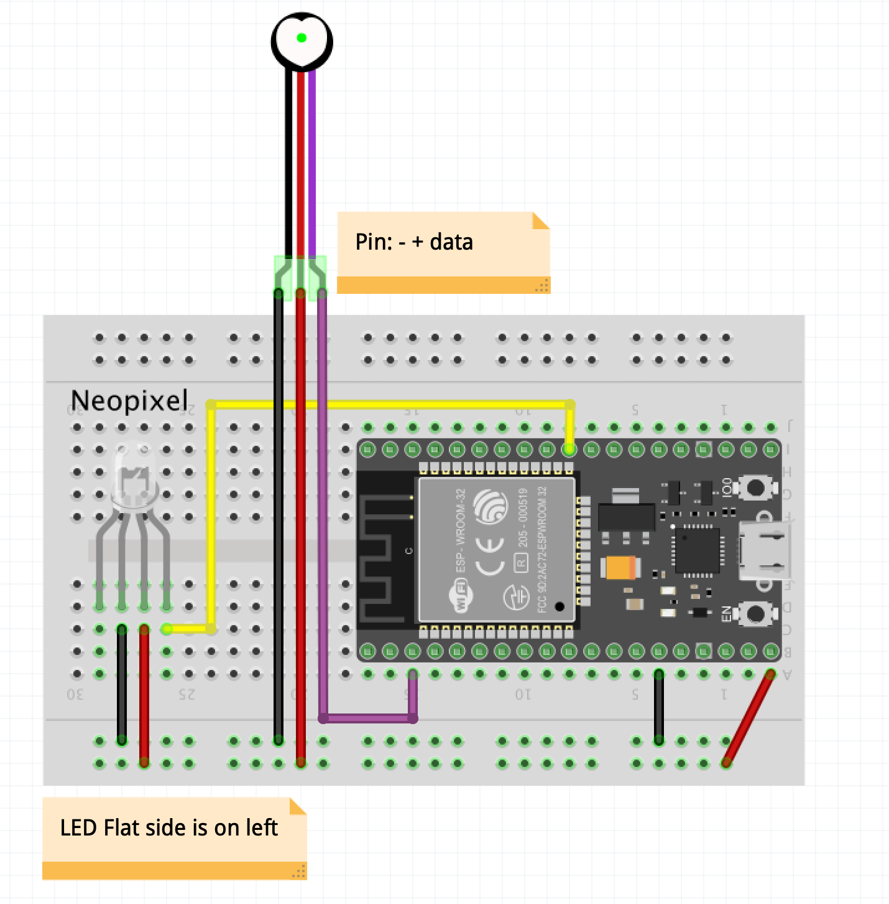
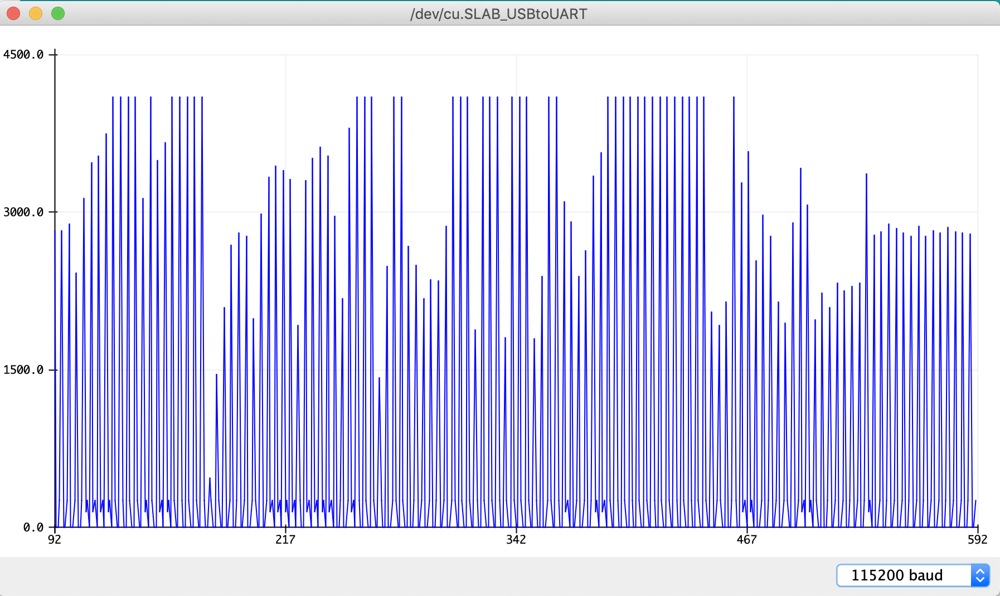
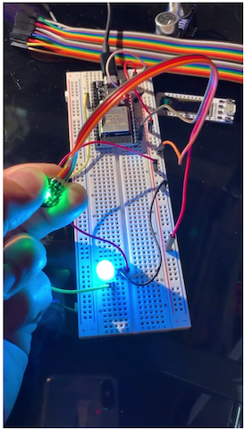

*Quick links :*
[Home](/README.md) - [Part 1](../part1/README.md) - [Part 2](../part2/README.md) - [Part 3](../part3/README.md) - [Part 4](../part4/README.md)  - [**Sensors**](/en/sensors/README.md)

***
**Sensor labs: ** [Sensor](README.md) - [Ultrasonic Sensor](ESP32S+Neopixel-LED+HC-SR04.md) - [Pyroelectric Infrared PIR Sensor](ESP32S+Neopixel-LED+PIR.md) - [Heart sensor](PULSE+RGB.md) - [OLED LCD Display Module](SSD1306_Display.md)
***

This part contains instruction to get started with Human Heart Rate/Pulse sensor on ESP32S

## Lab Objectives

In this lab you will learn how to connect the Pulse sensor to the ESP32S board and how to access data from the sensor, then take actions based on the data returned.

You will learn:

- The electrical connections needed to connect the Pulse sensor (pulsensor.com) to the ESP32S
- Run a simple application to read data from the sensor and change color of a Neo Pixel RGB
- The useful library used to build more advanced application using the sensor

Parts in this lab:

- ESP32S (36 pins)
- Human Heart Rate / Pulse sensor. Visit https://pulsesensor.com/ to have more details about the sensor, including getting started and playground library.
- Neo Pixel 8mm 
- male-male Jumpers

### Step 1 - Wire the parts together

First you need to wire the part together on a breadboard. Here is the circuit diagram of the example



GPIO 4 is used to control the LED colors. Data pin (purple) of the Pulse sensor is connected to analog pin A0 (GPIO 36)

### Step 2 - Input the application code

I've provided the code for the application below. The code is pretty simple with detailed explanation in the form of comments. You can copy and paste into to a new sketch on your Arduino IDE then compile and run it.


```C++
/* This code is to read raw pulse signal from a pulse sensor and change the 
 *  color or a Neo Pixel RGB accordinly to a pre-defined pulse range
 */

#include <Adafruit_NeoPixel.h>

int pulsePin = A0; // Pin Analog 0, or GPIO 36

#define ALARM 4000  //Alarm thresh hold
#define WARN 3000   //Warning thresh hold
#define NORMAL 2000 //Normal, below which is also Alarm thresh hold

#define NEOPIXEL_TYPE NEO_GBR + NEO_KHZ800
#define RGB_PIN 4   // Control pin for the Neo Pixel RGB

unsigned char r = 0;
unsigned char g = 0;
unsigned char b = 0;

float s = 0.0; //Initiate the analog signal

Adafruit_NeoPixel pixel = Adafruit_NeoPixel(1, RGB_PIN, NEOPIXEL_TYPE); // Initiate the neo pixel

// The SetUp Function:
void setup() {
  pixel.begin();
  Serial.begin(115200);         // Set's up Serial Communication. 
}// End setup

// The Main Loop Function
void loop() {
  s = analogRead(pulsePin);  
  
  // Set RGB LED Colour based on pulse
  
  r = (s >= ALARM || s <=NORMAL) ? 255 : ((s > WARN) ? 150 : 0);  // Turn the neo pixel RED if the pulse is above ALARM thresh hold or below the NORMAL thresh hold
  
  b = (s > WARN && s < ALARM) ? 255 : 0;        // Blue range
  
  g = (s > NORMAL && s < WARN) ? 255 : 0;       // Green range

  // This is just for testing purpose, comment out as needed

  Serial.println((String)"Signal value: "+s);
  
  Serial.println((String)"Red: " +  r);
  Serial.println((String)"Blue: " +  b);
  Serial.println((String)"Green: " +  g);
  
  
  pixel.setPixelColor(0, r, g,b );  // Set color for the neo pixel
  
  pixel.show();
  
  delay(500); // Act every 500ms
  
}//End loop

```

### Step 3 - Run the code and view output using the Serial Monitor, Serial Plotter

Save, compile and upload the sketch.  Once uploaded open up the Serial Monitor and set the baud rate to 115200, to match the rate set in the Serial.begin(115200) message.  You should see some basic output showing the raw pulse value read from the pulse sensor as well as the RGB values corresponding to each pulse value returned.  

The LED should be set to a colour based on the pulse value and the threashold set by NORMAL, WARN and ALARM constants defined at the top of the sketch :

- GREEN: Between NORMAL and WARN
- BLUE: Between WARN and ALERT
- RED: Above ALARM and below NORMAL

You can see the graphical view of the pulse output by opening the Serial Plottter view (Remember to close the Serial Monitor view first): Tool >> Serial Plotter



To see how the LED changes colors based on the pulse value, tighten the `touch` side of the sensor to your finger. You can change the threshold values (NORMAL, WARN, ALERT) in the code to test. Click the picture below to see

[](https://www.youtube.com/watch?v=-i0oZmwVW2M "Heart sensor")


### Step 4 - Load PulseSensor Playground library and examples

To see how to use the Pulse sensor in more advanced ways, there are some useful sketch examples that you can load into your IDE.  *Tools* -> *Manage Libraries* -> *Search for Pulse Sensor Playground* -> *Install*. After that, you can load an example from *File* -> *Examples* -> *PulseSensor Playgound* and select from the list.

***
**Sensor labs: ** [Sensor](README.md) - [Ultrasonic Sensor](ESP32S+Neopixel-LED+HC-SR04.md) - [Pyroelectric Infrared PIR Sensor](ESP32S+Neopixel-LED+PIR.md) - [Heart sensor](PULSE+RGB.md) - [OLED LCD Display Module](SSD1306_Display.md)
***
*Quick links :*
[Home](/README.md) - [Part 1](../part1/README.md) - [Part 2](../part2/README.md) - [Part 3](../part3/README.md) - [**Part 4**](../part4/README.md) - [Sensors](/en/sensors/README.md)